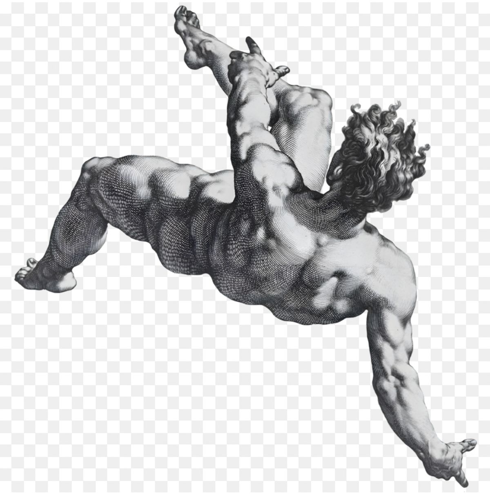
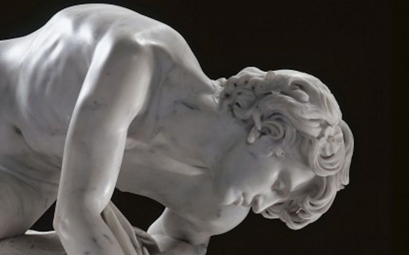
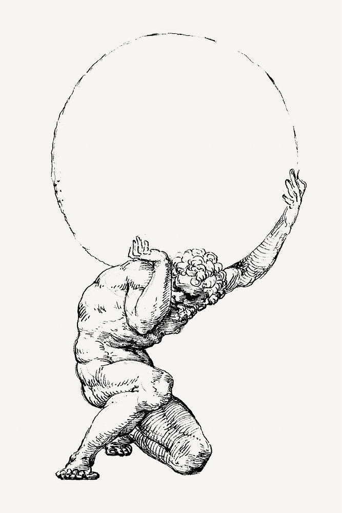

<p align="center">
  
  
  
</p>

<p align="center">[<a href="https://kylesalcedo.github.io/hubris-index/">what is your mythic flaw?</a>]</p>

---

## About

**Hubris Index** is a short personality quiz that maps you across three mythological archetypes drawn from Greek myth:

- **Icarus** — ambition and overreach. Burning too close to the sun.
- **Sisyphus** — discipline and endurance. Pushing the boulder, again and again.
- **Narcissus** — reflection and self-awareness. Lost in the mirror.

You answer 33 Likert-scale questions and receive a ternary-plot reading of your mortal compass — a point placed within the triangle formed by the three archetypes, along with percentage scores and an interpretation.

## Stack

| Layer       | Choice                        |
| ----------- | ----------------------------- |
| Framework   | React 18                      |
| Language    | TypeScript                    |
| Build tool  | Vite 6                        |
| Styling     | CSS Modules (no CSS framework) |
| Deployment  | GitHub Pages                  |
| Dependencies | Zero runtime deps beyond React |

## Technical showcase

- **Custom SVG ternary plot.** The archetype map is rendered from scratch in SVG — an equilateral triangle with gridlines at 10% intervals. The user's position is computed with [barycentric coordinates](https://en.wikipedia.org/wiki/Barycentric_coordinate_system): `point = icarus · A + sisyphus · B + narcissus · C`. No chart library dependency.
- **Zero-flash result transition.** Result-page images are preloaded during the quiz so the ternary plot and archetype portraits paint in one frame. A fade-in animation covers any residual jank.
- **Layout-stable navigation.** The "Back" control is always rendered but fades its opacity based on availability, so the quiz card never jumps in height between questions.
- **Keyboard dev shortcut.** Pressing `↑ ↓ → ← ↑` skips straight to a 33/33/33 results view, which makes iterating on the results UI much faster.
- **Pure CSS Modules.** Scoped class names per component, no runtime styling library, no Tailwind build step. The whole bundle gzips under 50 kB.
- **Responsive, serif-accented dark theme.** Playfair Display for display headings, Inter for body, a bronze (#d4a574) accent for interactive elements.

## Project structure

```
src/
├── App.tsx                 # Top-level state machine: landing → quiz → results
├── QuizQuestion.tsx        # One-question-at-a-time quiz card
├── Results.tsx             # Interpretation + scores + ternary plot
├── TernaryPlot.tsx         # Custom SVG barycentric chart
├── quiz-data.ts            # 33 questions, scoring, interpretations
└── *.module.css            # Per-component scoped styles
public/
├── icarus.jpg              # Archetype portraits (classical engravings / sculpture)
├── narcissius.jpg
└── sisyphus.jpg
```

## Running locally

```bash
npm install
npm run dev        # vite dev server
npm run build      # type-check + production build to dist/
npm run preview    # preview the production build
```

## Deployment

The site is built with `base: '/hubris-index/'` in `vite.config.ts` and deployed to GitHub Pages. All asset paths use `import.meta.env.BASE_URL` so images resolve correctly under the subpath.
